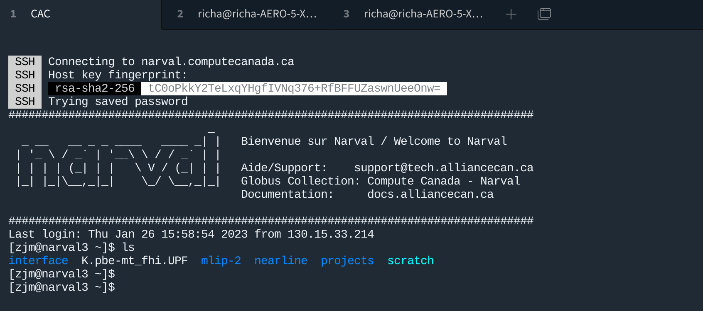

# MECH 461 Research Notebook
https://github.com/RichardZJM/K-MTP-training

##Introduction
This is the research notebook for the dataset generation of moment tensor potentials (MTP) for potassium, and the subsequent application in molecular dynamics simulations. Included is a week-by-week breakdown of the progress and findings of each session.

## Week 1
On the first week, consisted primarily of setup and understanding the MTP techniques used in the machine learning model. I started by meeting, Hao Sun, a post-doctorate student who is part of the Nuclear Materials group. His prior work involved the training of an MTP potential and thus his experience would be invaluable.

The first bit of setup focused on Compute Canada HPC cluster access. Compute Canada is a resource of the Digital Research Alliance of Canada. Registering with my supervisor Laurent Béland as the Principal Investigator (PI), gave me access to the more computational model which would be important for the training and active learning of the MTP. In particular, SSH access to Calcul Quebec's Narval supercomputer will be used for most of the simulation.

With access to Narval, I then took a closer examination of the mathematics and theory behind the MTP approach before I started work on developing training sets and running training the system.  This took much of the remainder of week 1 and a brief overview of my understanding is outlined below. A more in-depth description will be provided for the final report.

### The MTP interatomic model
<p style ="font-size:smaller">
Please note that the following are personal notes taken from [REF] that explain the MTP method for my personal reference and future understanding.
</p>

As an atomistic potential, the MTP method describes the energy of a system as a function of the configuration of its atoms. The MTP potential does this by considering the sum of the energies associated with each of the atoms within the system.

The energy of each atom can be defined as the weighted summations through a set of basis functions:

$$
V(n_i) = \sum_{\alpha} \xi_\alpha   \Beta_\alpha
$$

The weightings, $\xi_\alpha$, are trainable parameters in the machine learning of the algorithm. $\Beta_\alpha$ are the members of the basis function to the level specified as a model hyperparameter.

The basis functions are constructed with moment tensor descriptors. These moment tensor descriptors contain radial and angular components which capture the geometric representation of the system environment local to the atom whose energy is being calculated (as defined by a cutoff radius). 

Moment tensor descriptors are differentiated by two different parameters $\nu$ and $\mu$. The former can be conceptually thought of as the depth of the angular data that the particular moment tensor captures. The latter allows the system to exhibit more trainable radial parameters. The moment tensor descriptor for the $ith$ atom, described by $\nu$ and $\mu$, is the summation of the products of the corresponding radial and angular components between the $i$th atom and its $j$ neighbours. 

$$M_{\mu,\nu} (n_i)= \sum_{j} f_\mu (r_{ij},z_i,z_j) r_{ij} \otimes \dots \otimes r_{ij} $$

| Component | Description                            |
| --------- | -------------------------------------- |
| Radial    | $f_\mu (r_{ij},z_i,z_j)$               |
| Angular   | $r_{ij} \otimes \dots \otimes r_{ij} $ |
Where,  the important properties of the atoms in local enviroment are described by:

| Component | Description                            |
| :---------: | -------------------------------------- |
| $r_{ij}$    | Vector from the originating atom to its $j$th neighbour |
| $z_{i}$  | Species of the originating atom|
| $z_{j}$  | Species of the $j$th neighbour|

As moment tensors descriptor are described by $\nu$ and $\mu$, we can define a measure the complexity of a moment tensor descriptor based on these two values—the so-called *level* of a moment tensor descriptor. This is given by:

$$\textrm{lev}M_{\mu,\nu} = 2 + 4\mu + \nu$$

Where there the coefficients were determined through experimentation.

Additionally, we can perform binary tensor operations and contractions between various moment tensor descriptors to form additional expressions as long as the operations are valid and one of the following:

1. Dot Product
2. Frobenius Product
3. Scalar Multiplication

The level of an expression of moment tensor descriptors is given by the sum of the level of its constituents. 

We ultimately choose the basis set of the MTP model based on a *maximum level*, $\textrm{lev}_{\max}$ which serves as one of the model's hyperparameters. The basis set consists of all combinations of moment tensor descriptors that use the above operands to contract down to a single scalar value such that the formed expression has a level no more than $\textrm{lev}_{\max}$.  Accordingly, the number of trainable parameters is heavily dependent on $\textrm{lev}_{\max}$, scaling exponentially.

Now, consider the radial and angular components as characterized by the $\nu$ and $\mu$ of the particular moment tensor descriptor.

#### Radial Component of the Moment Tensor Descriptor
The radial component, $f_\mu (r_{ij},z_i,z_j)$, is described as the summation of the product of the members of the radial basis set, $Q^{(\Beta)(r_{ij})}$, and the corresponding trainable radial parameters $c^{\Beta} _ {\mu,z_i,z_j}$.

$$f_\mu (r_{ij},z_i,z_j) = \sum ^ {N_o} _ {\Beta = 1} c^{(\Beta)} _ {\mu,z_i,z_j}  Q^{(\Beta)}(r_{ij})$$

The number of members of the radial basis set, $N_o$ is chosen as a model hyperparameter. The basis set is conditionally evaluated based on the chosen cutoff radius and the minimum distance between atoms in the system, using Chebyshev polynomials on the interval $[R_{min}, R_{cut}]$.
=
$$Q^{(\Beta)}(r_{ij})=  \begin{cases}
    \phi ^{(\Beta)}(|r_{ij}|) (R_{cut} - |r_{ij}|)^2& |r_{ij}| < R_{cut} \\
    0 & wk
\end{cases}$$

Where $\phi^(n)$ represents the $n$th Chebyshev polynomial. This generates a Chebyshev polynomial sequence that smoothly decays to zero at the cutoff radius.

#### Angular Component of the Moment Tensor Descriptors
The angular component is a series of $\nu$ outer products performed on the position vector between the originating atom and its $j$th neighbour. The value of $\nu$ is dependent on the exact moment tensor descriptor. This angular component works to capture the angular information between two atoms and results in a tensor whose rank is equivalent to $\nu$.

#### MTP Model Overview
Overall,  the MTP potential provides a framework atop which radial and angular components are considered. Additionally, the tensor operations performed on the descriptors maintain the model's invariance to permutations, rotations, reflection, and translation. MTP has two hyperparameters which affect its accuracy and computational cost: $N_o$ and $\textrm{lev}_{\max}$ which determine the number of basis functions expressions and the number of Chebyshev polynomials evaluated in the radial basis set. 

The trainable parameters of the model are weightings with respect to the moment tensor basis sets and the radial basis sets, $\xi_\alpha$ and $c^{\Beta} _ {\mu,z_i,z_j}$ respectively. Collectively, the vector of trainable parameters will be further expressed as $x$.


### Training
To prepare an MTP for usage in MD simulations like LAMMPS, training is generally performed on quantum-mechanical databases. The initial training is performed using the quantum-mechanical energies $E^{qm}$, forces $f_i^{qm}$, and $\sigma^{qm}$ stress tensors. This is performed using a loss function which considers the sum of the square errors of the energies of a configuration, the sum of the squared magnitude of the force errors for each atom in a configuration, and the error of the Frobenius norm of the stress tensors of a configuration, for all configurations in the training data set.

The loss function is mathematically expressed for the number of configurations in the dataset, $K$

$$\sum_{k=1}^K w_e \delta E + w_f \delta F + w_s \delta S $$

Where, $w_e$, $w_f$, and $w_s$ represent weighting factors (user-chosen) that express the relative importance of each the energies, forces, and stress tensors respectively. Further, the error contributions for each property can be expressed for the $k$th configuration and trainable parameter vector, $x$.

| Component | Mathematical Expression | Description|
| :---------: | -------------------------------------- | -|
| $\delta E$    |$(E^\textrm{mtp}(\textrm{cfg}_k, x) - E^\textrm{qm}(\textrm{cfg}_k, x))^2$| Loss contribution from energy inaccuracies|
| $\delta F$    |$(E^\textrm{mtp}(\textrm{cfg}_k, x) - E^\textrm{qm}(\textrm{cfg}_k, x))^2$  | Loss contribution from force inaccuracies in each atom in the configuration||
| $\delta S$    |$(E^\textrm{mtp}(\textrm{cfg}_k, x) - E^\textrm{qm}(\textrm{cfg}_k, x))^2$ | Species of the $j$th neighbour| |

The mathematical optimization of this loss function doesn't use any special approach for gradient solving like backpropagation for more traditional ML techniques. Instead, we use a BFGS approach against the training set. Afterwards, an estimation of the trained potential accuracy can be obtained using root mean square error on the energies, forces, and stress tensors. RSME is shown for the energies below.


 $\textrm{RSME} (E)^2 = \frac{1}{K} \sum ^{K}_{k=1} (\frac{E^\text{mtp}(\text{cfg}_g,x)}{N^{(k)}}-\frac{E^\text{qm}(\text{cfg}_g,x)}{N^{(k)}})$

## Week 2
The validity of the MTP (and other machine learning potentials ) is predicated on the availability of high-fidelity training data. For the MTP, these calculations consist of DFT calculations using Quantum Espresso (QE). Most of Week 2 focused on familiarizing myself with the Narval HPC enviroment. 

### HPC Narval cluster

This all starts by connecting to Narval through my newly-minted Compute Canada account and SSH. Then, I follow the prompts, entering my password to gain access.

```
ssh -Y zjm@narval.computecanada.ca
```
Hao initially recommend me the MobaXterm terminal for automatic reconnection and SFTP (file transfer). However, I am currently running a Linux-based personal machine, and am using Tabby Terminal to perform the same.

Upon SSH'ing into Narval, I'm greeted with the home directory in one of the login nodes (narval3 in this case).



This is a Linux-based terminal environment with no GUI. I have some experience with similar environments having run Linux natively for CFD purposes.  I immediately started by setting up a git repository for the project. This is to hold version-controlled scripts, output files, and the research notebook. Moreover, I can easily perform edits on my local machine and push them to Narval without SCP or SFTP. Graphical applications such are Ovito are also unavailable on Narval. The Github link is available below.

https://github.com/RichardZJM/K-MTP-training

Narval utilizes the job scheduler Slurm Workload manager for intensive computations. Only tasks smaller than 10 CPU minutes and 4 RAM are permissible on the login nodes. Slurm is essentially a priority queue for Narval's nodes. Users submit job requests for system resources in job requests. Priority can be allocated based on the relative importance allocated to the project and the principal researcher. A job request resembles the below.

```sh
#!/bin/bash                                                 
#SBATCH --account=def-belandl1                  // PI's account
#SBATCH --ntasks=1                              // Number of CPUs for job
#SBATCH --time=0-2:00 # time (DD-HH:MM)         // Estimated job duration
#SBATCH --mem-per-cpu=9G                        // Memory per CPU requirement

//Code to run on the Narval compute nodes with allocated resources
// ...
```
Additional commands for the batch can be found here. https://slurm.schedmd.com/sbatch.html

A job is defined in the format above in a text file with the .qsub extension. They are submitted to the Slurm system using the sbatch command.

```sh
sbatch <file>
```
Listed below are some additional Slurm commands which are generally useful.

```sh
squeue                  # Shows the current jobs in queue and running
squeue -u zjm           # Shows the curret jobs associated with user
scancel <job number>    # Cancels the specified job
scancel -u zjm          # Cancels all jobs associated with user
```

With this knowledge, I began by preparing the environment to run DFT, MD, and prepare MTP potentials. Quantum Espresso was already present in the Narval environment and simply needed to be loaded into the active node using the below commands. MPI is needed for parallel processing.

```sh
module load    StdEnv/2020  gcc/9.3.0  openmpi/4.0.3
module load    quantumespresso/6.6
```

Additional information about modules can also be obtained with the below commands.

```sh
module spider                           # Gives information on all available modules
module spider quantumespresso           # Same but for a specific module
module spider quantumespresso/6.6       # Same but for specific version
```
The installation of MTP and its interface with LAMMPS was accomplished with the instructions on the project's Gitlab, available below.

https://gitlab.com/ashapeev/interface-lammps-mlip-2

This mostly included cloning from the repository, running a few installation scripts, and verifying the installation.

### Preparing the first DFT calculations

With the environment configured, I began to assemble the initial DFT training dataset. The first step is to utilize Quantum Expresso to determine the lattice parameter of BCC potassium from this value. This represents a realistic baseline from which the initial dataset can be built around. We start by determining DFT parameters which produce well-converged results, including the plane wave cutoff energy and the number of uniform k-points. From previous experience with convergence testing with Potassium in Quantum Espresso, I settled on the following parameters for all future Potassium DFT simulations.

| Parameter                | Value |
| :----------------------- | ----- |
| Plane Wave Cutoff Energy | 60 Ry |
| K-Point Count            | 8     |
| Pseudopotential          | K.pbe-mt-fhi.UPF 

Pseudopotential Source: https://github.com/buck54321/pyspresso/tree/master/pseudo

Referencing the experimental value of BCC potassium's lattice parameter, I locally performed ten DFT simulations whose lattice parameters surrounded the experimental value. This provided me with corresponding system energies which were then minimized. They were fed into Quantum Espresso ev.x's 2nd order Birch fitting function to predict a lattice parameter of **9.67166 Bohr.** Generally, when working on extending DFT calculations, it is important to use consistent simulation parameters. However, for this case, where the goal is to generate a baseline, the experimental lattice parameter would have probably worked. 

In any case, using the reference lattice parameter, I moved to perform bulk simulation on Narval. I received several scripts from Hao from which I adapted my first set of jobs for periodic potassium cells under shear and hydrostatic expansion/compression. These are all 1-atom simulation cells used to form a simpler initial training set. The following are my notes on the important points of the scripts' function. 

The create script is perhaps the most important one, responsible for the generation of the Quantum Espresso instructions which Slurm will schedule. The full script is available on Github, although here are the important points (some lines are omitted).

```sh
basefile = "K_e0bcc.txt";           # File name of the baseline lattice vectors
matl="K";etype="expansion_bcc";nat=1;   # Values for naming conventions

mkdir ../${matl}_${etype}_runs          # Generate an uncle directory to hold runs 

for e in `seq 0 26`; do         # Create runs with the specified offsets

a=$(echo "1+0.05*$e" | bc -l);          # For Expansion vary the length of 
b=$(echo "1+0.05*$e" | bc -l);          # the lattice vectors by 5% per degree of offset
c=$(echo "1+0.05*$e" | bc -l);

cat > top << EOF            # Generate a QE file
&control
    disk_io = 'none',
    prefix = '${matl}_expansion$e',        
    calculation ='scf',             # Self-consistet field calculation
    outdir = './out',
    pseudo_dir = '/home/zjm'            # Directory of pseudopotential
    tstress = .true.
    tprnfor = .true.
 /
 &system
    ibrav=0,            # Type of lattice = lattice vector specified
    nat=$nat,           # Number of atom in cell
    ntyp=1,             # Number of Species
    ecutwfc=60,         # Plane wave cutoff energy (Ry)
    occupations='smearing',     # Next three are smearing parameters
    smearing = 'gaussian',
    degauss = 0.01,

 /
 &electrons
    mixing_mode='plain',
    diagonalization='david',
/
 &ions
    ion_dynamics = 'bfgs'
 /
 &cell
 /
CELL_PARAMETERS
EOF

# Appends the contents of the baseline file and scales the lattice vectors
sed -n '3,5p' $basefile > cell
awk -v a=$a -v b=$b -v c=$c '{print a*$1,b*$2,c*$3}' cell > newcell

# Similar but with the pseudo and kp files (these are constants)
cat top newcell  pseudo kp > ${matl}_${etype}${e}.relax.in

# Makes a new directory to hold the new files and perfoms clean up 
mkdir ../${matl}_${etype}_runs/${matl}_${etype}${e}
mv ${matl}_${etype}${e}.relax.in ../${matl}_${etype}_runs/${matl}_${etype}${e}/
rm top cell newcell #clean-up
```

Overall, the scripts act very much like the previous Python scripts (shutil) I had used for automating QE runs in MECH 868. There is essentially a master file that retrieves values from auxiliary files and fuses them together to form members of a bulk run.

Those auxiliary files are kp, pseudo, and the baseline file.

The baseline file (K_e0bcc.txt), contains the lattice vector as determined by the previous energy minimization calculations. A slight offset is introduced to prevent symmetry although it may not be strictly necessary.  It also includes the atom positions, but for shear and expansion/contraction in 1 atom BCC, any position is valid, so the origin is chosen.

```txt
1     
CELL_PARAMETERS {bohr} 
   4.83583   4.83589   4.835813             # Vector 1
  -4.83582   4.83585   4.8358231            # Vector 2
  -4.83581  -4.83586   4.83583111           # Vector 3
Atom Positions {Angstrom}
K       0.000000000   0.000000000   0.000000000
```
The kp file simply specifics the number of automatic k-points.

```txt
K_POINTS automatic
8 8 8 0 0 0
```

The pseudo file is used to define the specific information including the atomic weight and the pseudopotential to use. 

```txt
ATOMIC_SPECIES
K  39.0983 K.pbe-mt_fhi.UPF         # Potassium, atomic weight = 39.0983
ATOMIC_POSITIONS angstrom
K  0   0   0
```

Overall, after using all these files, we end up with an uncle directory which contains sub-directories which each contain a QE input file for one of the specified expansion/contraction levels.

A very similar process is used to generate the input files for the shear calculation. The difference is the create files script. Instead of modifying the scale of all of the lattice vectors, only the v1 vector is modified to change the shape of the cell. 

```sh

# ...

for e in `seq 1 50`; do

a=$(echo "0.1*$e" | bc -l);      # Only the a parameter is variable
b=$(echo "1+0*$e" | bc -l);
c=$(echo "1+0*$e" | bc -l);

# ...
# The last two parameters of the v1 lattice vector are modified,
# Results in the shear deformation of the cell.
awk -v a=$a -v b=$b -v c=$c '{print $1,a+$2,$3+a}' cell > newcell   

# ...
```
Once the QE job files are generated, the submit bulk run scripts are used to pass the jobs to the Slurm manager. For these single-atom simulations, a single core for twenty minutes should be more than sufficient although the resource requirements will increase for more complex configurations.

```sh
#!/bin/bash
matl="K";etype="expansion_bcc";     # Constants for job name / type

for e in `seq 0 26`; do      # Which jobs to submit

# Generate a Slurm job file
cat > runscript << EOF

#!/bin/bash
#SBATCH --account=def-belandl1
#SBATCH --ntasks=1                     # 1 core is fine
#SBATCH --time=0-2:00 # time (DD-HH:MM)            # 2 hours is probably excessive
#SBATCH --mem-per-cpu=9G            # Probably don't need this much RAM

# Load Quantum Espresso on the Compute Node(s)

module load    StdEnv/2020  gcc/9.3.0  openmpi/4.0.3
module load    quantumespresso/6.6

# Navigate to the QE input
cd /home/zjm/scratch/K-MTP-training/initial_dft_dataset_sim_files/${matl}_${etype}_runs/${matl}_${etype}${e}

# Run with parallel processing on 1 CPU
mpirun -np 1 pw.x < ${matl}_${etype}${e}.relax.in > ../../output/${matl}_${etype}${e}.relax.out

EOF

cp runscript ../${matl}_${etype}_runs/${matl}_${etype}${e}/job_${matl}_${etype}${e}.qsub

# Submit the Slurm job to Slurm
sbatch ../${matl}_${etype}_runs/${matl}_${etype}${e}/job_${matl}_${etype}${e}.qsub
done
rm runscript #clean-up
```

The submission script for shears is the same script with variations on the for loop and the job name constants.

Overall, this gives a framework through which we can easily create a training dataset of DFT data. While this iteration is limited to 1 atom, it should be fairly trivial to modify it for more atoms. I have prior experience doing so although it was done with Python, a language I'm a bit more familiar with.

The rest of the week was mostly spent running simulations and Narval to better familiarize with the system and prepare various samples for the initial training of the MTP.

## Week 3

Week 3 started by reconfiguring and troubleshooting the environment on the Narval setup to start running the MTP.  In the previous weeks, the MLIP interface had been installed improperly although it hadn't been detected due to the verification script mostly focused on confirming that LAMMPs itself had been installed correctly. As a personal note, in the future when I may need to reinstall the MTP interface package, the package must be cloned from the repository in its directory (ie. not in the same directory as the MLIP package). The library packages are created in the lib folder of the MLIP package and must be copied into the interface package manually. Additionally, the install script for the interface takes several minutes to run and produces detailed logs. This is important as failure to install the interface may pass the validation script for LAMMPS. 

After, resolving issues with the interface, I began to assemble the first training set. Using the shell script-based process obtained in the previous week, 


# References
https://iopscience.iop.org/article/10.1088/2632-2153/abc9fe
/home/zjm/mlip-2/bin/mlp train 08.mtp mlip_input.cfg --energy-weight=1 --force-weight=0.01 --stress-weight=0.001 --max-iter=10000 --bfgs-conv-tol=0.000001 --trained-pot-name=pot.mtp

/global/home/hpc5146/mlip-2/bin/mlp train 08.mtp train.cfg --energy-weight=1 --force-weight=0.01 --stress-weight=0.001 --max-iter=10000 --bfgs-conv-tol=0.000001 --trained-pot-name=pot.mtp


Week4-5

1st generate two-atom configurations (hydrostatic expansion or compression, within ~5% strain, temperatures (100K)). later we add data for high temperatures (400K, 200K)

Using python scripts

2nd run MD simulations with active learning mode. (check each configuration to see whether it is risky) Nothing we can do

Setup a new state.als file using a  new command:
/global/home/hpc5146/mlip-2/bin/mlp calc-grade pot.mtp train.cfg train.cfg out.cfg --als-filename=state.als
This file path us tbe specified in the MTP MD config ini file

Create multiple MD files.
Change the input data to different strains (hydrostatic compression and expansion aro 5%) at two different temps above melt and two below
This introduces different interactions t differnt ranges but its not too unrealistic
Run these simulations the active learning enabled
The risky configurations will be save in a preselected.cfg file (autogenerated for each run)


3rd From step 2, we have a preselected.cfg file, in which every risky configuration is included.Nothing we can do

Don't do anything (just intermeidate  step)

4th, run a command to check whether all the configurations in preselected.cfg are necessary. Nothing we can do

/global/home/hpc5146/mlip-2/bin/mlp select-add /global/home/hpc5146/Projects/K-MTP-training/phase2/mdLearning/pot.mtp train.cfg ../activeLearningDFT/preselected.cfg diff.cfg --als-filename=state.als

We run a check.sh on the folder.
This visits all the sister directory which hold the MD runs
It generates a diff.cfg file which has the representative configs for each preselected run.

(Try combined the preselected instead of creating seperate diff.cfgs ???)


5th create DFT input files and run DFT. 
Run DFT on each of the configurations generated by the diff.cfg

6th add DFT result into our training data set and retrain the potential.
Run the passive training on the new set of union of the current set and the new results from the diff.cfg dft results/
